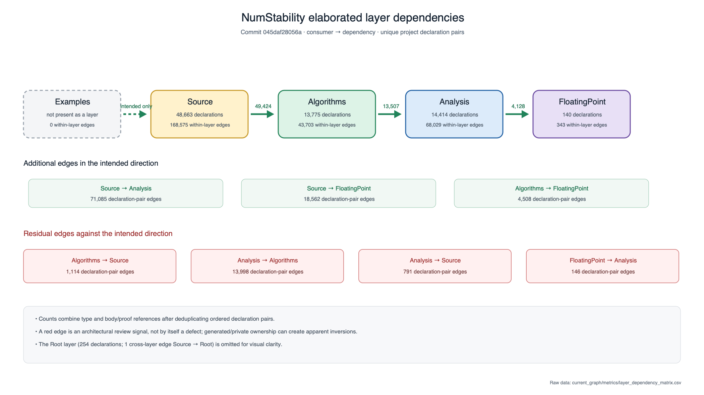
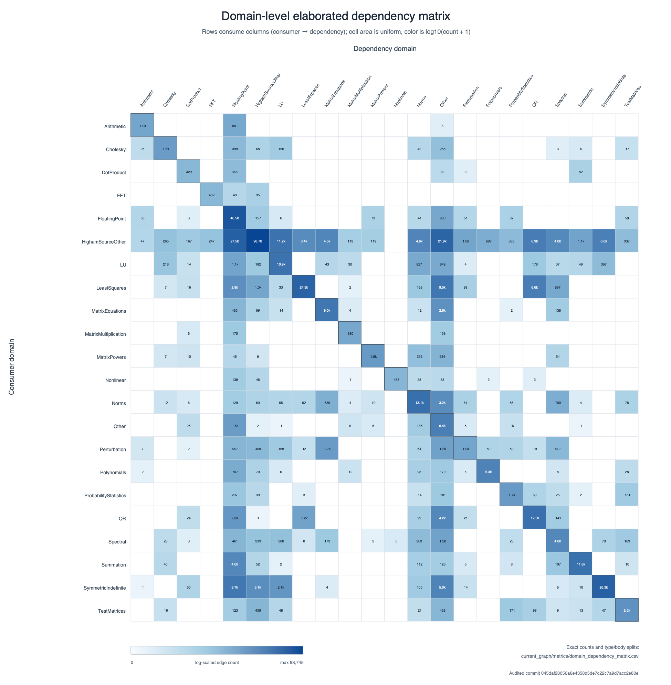
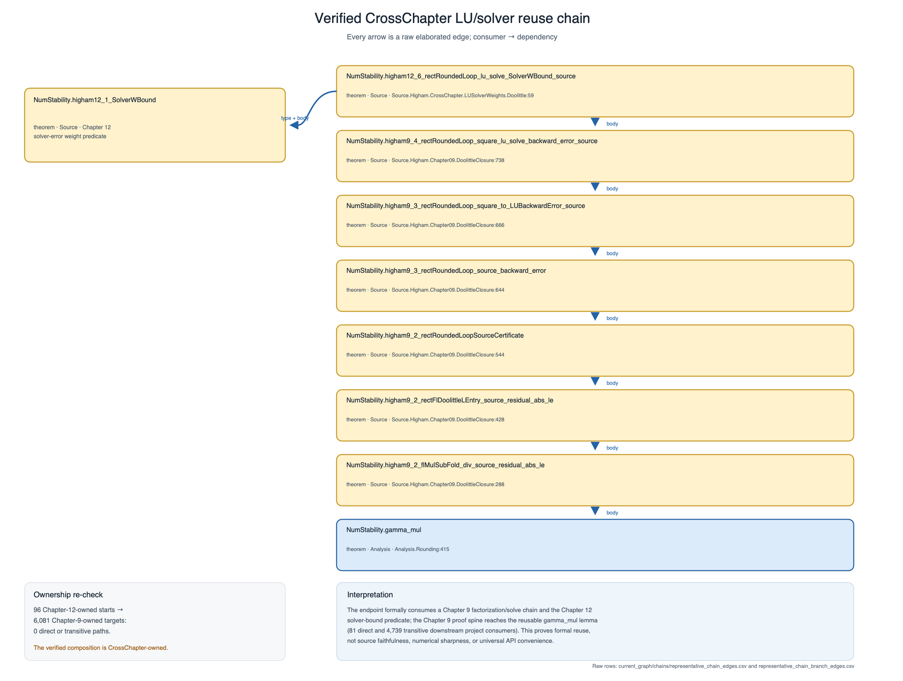

# NumStability architecture, dependency, cohesion, and public-consumability audit

## Audit result at a glance

This report is a fresh, read-only audit of the exact commit currently resolved
from `origin/higham_v01`:

```text
045daf28056a6e4358d5de7c22c7a9d7acc2e80e
```

At capture time, local `higham_v01`, local `origin/higham_v01`, and the live
remote `refs/heads/higham_v01` all resolved to that hash. The detached audit
worktree remained source-clean. The caller's checkout was not switched, and no
Lean source, import, declaration, module, commit, or remote state was changed.

The main findings are:

- **Build evidence is qualified.** A full `lake build` over same-commit cached
  artifacts exited 0 with no errors. A genuinely fresh full build did not
  complete because the host ran out of disk space; its approximately 101-second
  partial duration and the successful 2.80-second cached run are not clean
  compilation times. No Lean error occurred before either fresh attempt was
  stopped.
- **Exact historical tooling was recovered.** The Phase 10A extractor and
  summarizer were recovered byte-for-byte and replayed unchanged against this
  commit. Aggregate comparison is valid only for their original schema and
  filters. The historical raw declaration TSV was not recovered, so named
  declaration, stable-edge, move/rename, and chain-level before/after claims are
  unavailable.
- **The strongest cohesion result is directional, not merely connectedness.**
  In the conservative source-token-confirmed public universe, 35,889/47,890
  declarations (74.9405%) have at least one incoming project declaration
  reference, 12,584/47,890 (26.2769%) are used from another owner module, and
  46,811/47,890 (97.7469%) participate in a dependency chain of at least two
  edges. These rates come from the authoritative
  [`current_graph/metrics/incoming_and_cross_boundary_coverage_contract.csv`](current_graph/metrics/incoming_and_cross_boundary_coverage_contract.csv),
  columns `numerator`, `denominator`, `percent`, `exact_universe_filter`, and
  `exact_metric_filter`, derived from
  `raw/declarations.csv.gz` (`name`, `is_internal`, `is_private`) and
  `raw/direct_dependencies.csv.gz` (`source`, `target`, `target_scope`, owner
  modules). They establish internal formal consumption and compositional
  typechecking, not source faithfulness or interface quality.
- **The strongest concrete cross-chapter chain is explicit.** The
  CrossChapter-owned theorem
  `NumStability.higham12_6_rectRoundedLoop_lu_solve_SolverWBound_source`
  directly consumes both the Chapter 9 Doolittle closure and the Chapter 12
  `SolverWBound` predicate, while its seven-edge Chapter 9 proof spine reaches
  `NumStability.gamma_mul`. An exhaustive check found no direct or transitive
  path from a Chapter12-owned declaration to a Chapter09-owned declaration;
  the actual bridge is deliberately owned by
  `Source.Higham.CrossChapter.LUSolverWeights`.
- **Representative narrow public APIs are consumable.** All 15/15 predeclared
  canonical declarations passed an independent narrow-import `#check`, and
  all 15/15 separately compiled minimal external client theorems. The exact
  sample, filters, statuses, assumptions, and friction notes are in
  [`probes/results.csv`](probes/results.csv). This is strong evidence for those
  clients, not a library-wide 100% usability claim.
- **The reorganization is measurable.** Under the exact Phase 10A source
  scanner, modules rose from 957 to 2,839 while normalized source bytes fell
  from 69,590,164 to 69,455,337. Declaration-bearing owner modules rose from
  803 to 1,649 while mean declarations per such module fell from 102.055 to
  46.844. Cross-module measures consequently have a substantial
  file-boundary confound and cannot be read as pure increases in mathematical
  reuse.
- **The most important limitation is the missing successful clean full build.**
  The retained compiled graph and successful cached verification are exact-
  commit evidence, but an uninterrupted clean-output build on a host with
  sufficient storage is still required for a clean full-build status and time.

The machine-readable synthesis is [`metrics.json`](metrics.json). Detailed
chain, API, architecture, history, timing/hygiene, reproduction, and limitation
reports are linked in the [artifact index](#artifact-index).

## Scope, method, and metric contract

### Source and compiled scope

The source universe is `NumStability.lean` plus every `NumStability/**/*.lean`
file discovered with `rg --files -uu`: 2,839 Lean files/modules. The compiled
environment was formed by importing `NumStability`, whose default-target chain
is:

```text
NumStability
  -> NumStability.All
       -> NumStability.Algorithms
       -> NumStability.Analysis
       -> NumStability.FloatingPoint
       -> NumStability.Source
            -> NumStability.Source.Higham
```

Those arrows are source imports. They are not declaration-reference edges.
The nine separately reviewed root/aggregate entry points are `NumStability`,
`NumStability.All`, `NumStability.Core`, `NumStability.FloatingPoint`,
`NumStability.Analysis`, `NumStability.Algorithms`, `NumStability.Source`,
`NumStability.Source.Higham`, and the legacy aggregate
`NumStability.Higham`. The complete entry-point inventory is
[`static_architecture/entry_points.csv`](static_architecture/entry_points.csv).

### Declaration-edge orientation

For every compiled declaration graph, matrix, path, and fan metric:

```text
A -> B means declaration A directly references declaration B
       in A's elaborated type or body/proof.
```

Thus the arrow runs from consumer to dependency. The raw extractor emits one
row per unique ordered pair with overlapping Boolean columns
`occurs_in_type` and `occurs_in_body`; a pair occurring in both is counted once
in the union. Type and body counts must therefore never be added without
subtracting the intersection.

### Kept-separate declaration universes

The current graph schema is
`numstability-elaborated-architecture/2.1.0`, analyzer SHA-256
`543159b9dd6645a19c736a27cda585701b66fe6134d457b4eb891dd26c842d45`.
Its validated declaration universes are:

| Universe | Exact filter | Count | Primary columns |
| --- | --- | ---: | --- |
| All project-owned environment declarations | owner module is `NumStability` or `NumStability.*` | 77,246 | `raw/declarations.csv.gz`: `name`, `module` |
| Environment-public | all-project universe and `is_internal=false`, `is_private=false` | 58,120 | same artifact: `is_internal`, `is_private` |
| Environment private/internal | complement of current environment-public filter | 19,126 | same columns |
| Confirmed source-written | nonreserved, direct Lean selection range, and exact selected source token matching the terminal name or namespace-qualified suffix | 49,573 | `raw/declaration_metadata.csv` range columns, `raw/declaration_origins.csv:is_reserved_name`, static source |
| Confirmed source-written public | intersection of the preceding two filters | 47,890 | `current_graph/metrics/declaration_origins_and_authorship.csv`: `authorship_class`, `is_public` |
| Reserved/generated-name signal | `Environment.isReservedName=true` | 7,691 | `raw/declaration_origins.csv:is_reserved_name` |
| Generated or authorship-unresolved | every declaration outside the confirmed class | 27,673 | `current_graph/metrics/declaration_origins_and_authorship.csv:authorship_class` |
| With / without bodies | `has_body=true/false` | 75,557 / 1,689 | `raw/declaration_metadata.csv:has_body` |

“Confirmed source-written” is an operational source-origin class, not proof
of human authorship: a macro-produced name can inherit a source range. The
unresolved class is retained rather than silently described as generated.
Constructors, recursors, equation lemmas, congruence lemmas, match splitters,
and reserved names are never presented as handwritten public API merely
because their environment visibility is public.

### Derived metric definitions

- A **direct project pair** is a unique ordered declaration pair whose target
  is also project-owned.
- **Incoming-reference coverage** counts target declarations in the named
  universe with at least one distinct incoming direct edge from any project
  declaration, divided by the number of declarations in that universe.
- **Cross-module use** counts target declarations in the named universe with
  at least one incoming direct edge from a different owner module, divided by
  that universe.
- **Transitive downstream count** is the number of distinct reverse-reachable
  project declarations excluding self, computed exactly after collapsing
  strongly connected components.
- **Dependency depth** is longest-path depth in the SCC condensation DAG.
- **Weak components** are computed on the named universe's induced undirected
  graph. They measure connectedness, not reuse.
- Percentiles in the declaration graph use nearest rank,
  `sorted[ceil(q*n)-1]`, with p0 the minimum. Timing percentiles instead use
  R-7 linear interpolation and are explicitly labelled as such.
- Layer, domain, and chapter are deterministic path/name classifications,
  not kernel facts or a semantic ontology.

The complete schema and validation invariants are in
[`current_graph/metrics/SCHEMA.md`](current_graph/metrics/SCHEMA.md) and
[`current_graph/validation_tests.log`](current_graph/validation_tests.log).
Seven regression tests pass, including a sibling-cross-edge DAG case that
detects the SCC defect in the later recovered analyzer. The raw declaration,
origin, and metadata universes match exactly; no project targets are missing;
and the raw project graph has no duplicate ordered pair.

Four QA supplements retain separate, explicit schemas: the coverage contract
`numstability-coverage-metric-contract/1.0.0` (builder SHA-256
`1967659d5b85cd5114bfbc7dc87d41e8c09269e8cae4991d82b829f3e9de6e1a`),
public type exposure `numstability-public-type-exposure/1.0.0` (analyzer
SHA-256
`1fb91f07610320ed420698e0ddd9c89bc16307c3fe81796885beed9ec7fbaf60`),
all-source-written induced components
`numstability-source-written-components/1.0.0` (analyzer SHA-256
`df53e2de72028c1797fc5e0a68613e5bfe3f5bd1b8fbf43aa23932971f6dc05f`),
and universe-separated reuse leaders `numstability-reuse-leaders/1.0.0`
(builder SHA-256
`a7c171d48b8c8c8295c2116866ee1a29c8f32737a53eb4867ffb8678a01abd26`).
Their output hashes are recorded in `metrics.json`; definitions and validation
rules are appended to the schema linked above.

## Reproducibility, provenance, and build status

| Item | Recorded value |
| --- | --- |
| Audit timestamp | final environment capture `2026-09-03T11:19:42+0300`, `Europe/Athens` (`EEST`); final ref/cleanliness recheck `2026-09-03T12:40:18+0300 EEST` |
| Host | macOS 26.5.2 build 25F84; Darwin 25.5.0; arm64; 8 logical/8 physical CPUs; 16 GiB RAM |
| Lean | 4.29.0-rc3, commit `5d86aa4032284a5242470e95fbe25f1ff506763d` |
| Lake | `5.0.0-src+5d86aa4` |
| Mathlib | `e8ea1afc32790ce1d4e1a4e45cc412ba9388716b` (`v4.29.0-rc3-80-ge8ea1afc32`) |
| Lake packages | all 9/9 checkouts matched `lake-manifest.json` |
| Isolated source state | detached at audited hash; clean before and after every build episode |

The exact package revisions, input hashes, branch state, platform output, and
commands are in [`provenance/build_environment.json`](provenance/build_environment.json),
[`provenance/BUILD_AND_ENVIRONMENT.md`](provenance/BUILD_AND_ENVIRONMENT.md),
and [`REPRODUCE.md`](REPRODUCE.md).

| Build episode | Output class | Exit | Defensible interpretation |
| --- | --- | ---: | --- |
| First `lake build` | fresh project outputs; pinned dependencies newly materialized | 1 | stopped by `ENOSPC` after 4,232/6,031 tasks and 61 project oleans; no Lean error observed |
| Second `lake build` | fresh project outputs; exact cached dependencies | 130 | deliberately capacity-stopped after 17.49 s because projected 8.2 GiB output exceeded about 7.1 GiB free |
| Final `lake build` | complete APFS-cloned same-commit cached project outputs | 0 | Lake accepted the target graph; 0 `Built`, 160 `Replayed`, 0 errors; 2.80 s is cached verification only |

The authoritative episode table is
[`build/build_attempts.csv`](build/build_attempts.csv), columns `classification`,
`exit_status`, `real_seconds`, `dependency_state`, and `terminal_condition`.
No incremental or cached timing is presented as a clean compile time.

## Declaration and source inventory

### Physical source organization

| Physical layer | Modules | Physical lines | Code-bearing lines | Static declaration starters |
| --- | ---: | ---: | ---: | ---: |
| Root | 8 | 422 | 365 | 0 |
| FloatingPoint | 7 | 1,085 | 439 | 47 |
| Analysis | 448 | 405,930 | 249,606 | 9,566 |
| Algorithms | 944 | 608,335 | 173,874 | 7,416 |
| Source | 1,414 | 2,643,659 | 757,981 | 29,613 |
| Upstream compatibility | 5 | 1,406 | 1,092 | 77 |
| Historical `NumStability/Higham/**` | 13 | 109 | 17 | 0 |
| **Total** | **2,839** | **3,660,946** | **1,183,374** | **46,719** |

Rows come from [`static_architecture/modules.csv`](static_architecture/modules.csv),
columns `physical_layer`, `physical_lines`, `code_bearing_lines`, and
`static_declaration_starter_count`; totals are in
[`static_architecture/summary.json`](static_architecture/summary.json).
Static introducers are lexical source matches, not compiled declarations or
authorship claims.

All 28 `Source.Higham.Chapter01`–`Chapter28` roots exist. Exactly
1,405/1,414 Source modules (99.36%) use an exact `Source.Higham.ChapterNN`
path; the remaining nine are the source root and coherent `CrossChapter`
subtree. This percentage is computed from
[`static_architecture/modules.csv`](static_architecture/modules.csv), columns
`module`, `source_path`, and `physical_layer`, by filtering the 1,414
`physical_layer=Source` rows and matching the exact module-path pattern.
Chapter-root presence is a separate check in
[`static_architecture/chapter_hierarchy.csv`](static_architecture/chapter_hierarchy.csv),
columns `chapter` and `canonical_aggregate_module_present`.

### Compiled inventory

| Mutually exclusive compiled kind | Count |
| --- | ---: |
| Theorem | 62,115 |
| Definition | 9,344 |
| Abbreviation | 3,844 |
| Constructor | 711 |
| Recursor | 486 |
| Structure | 365 |
| Instance | 254 |
| Inductive | 121 |
| Axiom | 6 |
| **Total** | **77,246** |

The refined-kind inventory is in
[`current_graph/metrics/declaration_inventory.csv`](current_graph/metrics/declaration_inventory.csv),
rows `dimension=refined_mutually_exclusive_kind`, columns `category`, `count`,
`universe_denominator`, and `filters`. The raw kernel-kind view is retained
separately and counts 62,152 theorems, 13,405 definitions, 711 constructors,
486 inductives, 486 recursors, and six axioms. The environment owns 77,246
declarations in 1,649 owner modules; 39,157 declaration metadata rows carry a
docstring. Docstring presence is not a documentation-quality measure.

By physical owner layer the compiled environment contains 48,663 Source,
14,414 Analysis, 13,775 Algorithms, 254 Root, and 140 FloatingPoint
declarations. Domain, chapter, and top-level-namespace distributions remain
machine-readable in the inventory CSV and per-declaration metrics; the report
does not collapse them into a single “cohesion score.”

### Public aggregate exposure

Compiled transitive import closure plus the entry module—or, for
declaration-free unobserved entries, the validated static fallback described
below—exposes:

| Entry | Environment-public reachable | Confirmed source-written public reachable |
| --- | ---: | ---: |
| `NumStability` | 58,120/58,120 (100%) | 47,890/47,890 (100%) |
| `NumStability.All` | 58,120/58,120 (100%) | 47,890/47,890 (100%) |
| `NumStability.Algorithms` | 54,149/58,120 (93.1676%) | 44,770/47,890 (93.4851%) |
| `NumStability.Analysis` | 29,543/58,120 (50.8310%) | 25,467/47,890 (53.1781%) |
| `NumStability.FloatingPoint` | 1,653/58,120 (2.8441%) | 1,347/47,890 (2.8127%) |
| `NumStability.Core` | 1,007/58,120 (1.7326%) | 849/47,890 (1.7728%) |
| `NumStability.Source` | 56,401/58,120 (97.0423%) | 46,499/47,890 (97.0954%) |
| `NumStability.Source.Higham` | 56,401/58,120 (97.0423%) | 46,499/47,890 (97.0954%) |
| `NumStability.Higham` | 56,401/58,120 (97.0423%) | 46,499/47,890 (97.0954%) |

Every percentage and numerator/denominator in this table is a verbatim row of
[`current_graph/metrics/public_entrypoint_exposure_all.csv`](current_graph/metrics/public_entrypoint_exposure_all.csv),
columns `entry_module`, `closure_basis`, `universe`,
`reachable_declarations`, `universe_declarations`, `percent`, and
`coverage_status`. This is the authoritative table for all 479 predeclared
entry modules and all three declaration universes (1,437 rows): 439 entries use
compiled import closure and 40 declaration-free entries use a validated static
source-import closure joined to compiled declaration ownership. Static and
compiled closures agree for all 439 observed entries. The older
`public_entrypoint_exposure.csv` is superseded; in particular, its 117 zero
rows for entry points absent from the root-loaded compiled module graph must
not be interpreted as zero exposure. Reachability means owner-module exposure,
not practical ease of use.

## Direct dependency graph and directional reuse

### Pair counts and boundaries

The all-environment project graph contains 458,414 unique ordered declaration
pairs: 283,049 occur in the consumer type, 406,528 in its body/proof, and
231,163 in both. Therefore `283,049 + 406,528 - 231,163 = 458,414`.

Of the union pairs, 190,183 are intra-module and 268,231 cross-module;
177,264 cross architectural layers; 177,642 cross classified domains; 4,507
cross classified Higham chapters; and 148,458 cross top-level namespaces.
These are all-environment pair counts, not rates of source-written reuse. The
authoritative rows are
[`current_graph/metrics/direct_project_dependencies.csv.gz`](current_graph/metrics/direct_project_dependencies.csv.gz),
columns `source`, `target`, modules, layer/domain/chapter categories,
`occurs_in_type`, `occurs_in_body`, `same_module`, `cross_namespace`,
`cross_layer`, `cross_domain`, and `cross_chapter`.

### Incoming-reference and boundary coverage

| Exact target-declaration universe | ≥1 incoming project reference | Used by another module | Used by another layer | Used by multiple modules | Used by multiple domains |
| --- | ---: | ---: | ---: | ---: | ---: |
| All project environment declarations | 50,532/77,246 (65.4170%) | 13,549/77,246 (17.5401%) | 6,276/77,246 (8.1247%) | 10,143/77,246 (13.1308%) | 5,520/77,246 (7.1460%) |
| Environment-public (`!internal && !private`) | 39,012/58,120 (67.1232%) | 12,966/58,120 (22.3090%) | 6,103/58,120 (10.5007%) | 9,565/58,120 (16.4573%) | 5,264/58,120 (9.0571%) |
| Confirmed source-written public | 35,889/47,890 (74.9405%) | 12,584/47,890 (26.2769%) | 5,962/47,890 (12.4494%) | 9,260/47,890 (19.3360%) | 5,126/47,890 (10.7037%) |

Every percentage in this table uses the row universe as denominator and counts
distinct dependency targets, not edge occurrences. The exact numerators,
denominators, percentage formula, universe predicate, metric predicate,
authorship evidence, materialized columns, and underlying raw columns are
recorded row-by-row in the authoritative
[`current_graph/metrics/incoming_and_cross_boundary_coverage_contract.csv`](current_graph/metrics/incoming_and_cross_boundary_coverage_contract.csv),
columns `universe`, `metric`, `numerator`, `denominator`, `percent`,
`percentage_formula`, `exact_universe_filter`, `exact_metric_filter`,
`consumer_and_dependency_universe`, `materialized_artifact`,
`materialized_columns`, `authorship_artifact`, `authorship_columns`,
`underlying_raw_artifacts`, and `underlying_raw_columns`. The earlier
`incoming_and_cross_boundary_coverage.csv` remains the materialized numerical
table; the contract CSV is the citation authority for all 27 percentages.

For the same three universes, declarations with no incoming project edge are
26,714/77,246 (34.5830%), 19,108/58,120 (32.8768%), and 12,001/47,890
(25.0595%); declarations with neither incoming nor outgoing project edge are
5,450/77,246 (7.0554%), 170/58,120 (0.2925%), and 143/47,890 (0.2986%).
These percentages and their exact predicates use the same coverage-contract
artifact and columns. “No incoming” is deliberately not labelled “unused”: a
declaration may be an intended external endpoint.

### Fan-in, fan-out, and reusable foundations

Nearest-rank distribution summaries are:

| Universe / metric | p50 | p90 | p95 | p99 | max |
| --- | ---: | ---: | ---: | ---: | ---: |
| All declarations, direct fan-in | 1 | 6 | 13 | 66 | 13,255 |
| All declarations, direct fan-out | 4 | 15 | 21 | 28 | 130 |
| All declarations, transitive downstream consumers | 3 | 62 | 176 | 1,031 | 13,992 |
| Confirmed source-written public, direct fan-in | 1 | 9 | 19 | 112 | 13,255 |
| Confirmed source-written public, direct fan-out | 6 | 19 | 22 | 31 | 130 |
| Confirmed source-written public, transitive downstream consumers | 4 | 86 | 231 | 1,255 | 13,992 |

The exact universes, counts, means, percentile formula, and all quantiles are
in [`current_graph/metrics/fan_and_depth_distributions.csv`](current_graph/metrics/fan_and_depth_distributions.csv),
columns `universe`, `metric`, `percentile_method`, `count`, `mean`, and
`p00`–`p100`.

The leading direct consumers confirm that familiar foundations are reused:
`NumStability.FPModel` has direct fan-in 13,255 and reaches 13,992 transitive
downstream declarations in 532 modules; `gammaValid` has fan-in 5,114;
`gamma` 4,682; `infNorm` 3,406; `FPModel.u` 3,186; `rectMatMul` 2,581;
`vecNorm2` 2,395; `fl_backSub` 2,230; and `matMul` 2,218. Exact names,
owner modules, kinds, depths, downstream module/domain/chapter **counts**, and
ranking metric are in the universe-separated
[`current_graph/metrics/reuse_leaders_by_universe.csv`](current_graph/metrics/reuse_leaders_by_universe.csv).
The full downstream domain and chapter sets for each declaration are in
[`current_graph/metrics/declaration_metrics.csv.gz`](current_graph/metrics/declaration_metrics.csv.gz),
columns `transitive_downstream_domains` and
`transitive_downstream_chapters` (with their corresponding count columns).
High fan-in establishes internal consumption, not automatically a good public
interface.

The new ranking table covers four declaration universes—every project
declaration, environment-public, confirmed source-written, and confirmed
source-written public—and eight metrics, retaining the top 100 rows for each
combination (3,200 rows). Every consumer count, including rankings of a
filtered declaration universe, is computed against the **all-project consumer
universe**. The additional “reused low in hierarchy” product is defined
exactly as

```text
transitive_downstream_consumer_count
  * (1 + downstream_depth_scc_condensation)
```

For example, `NumStability.FPModel` ranks first in all four universes with
`13,992 * (1 + 51) = 727,584`. This product is only a sorting heuristic that
combines broad reverse reach with a long reverse-consumer path. It is not a
cohesion score, must not be aggregated over the library, conflates two
different properties, and is dominated by large reach values. The formula,
tie-breaking tests, toy validation, and reproduction of 500 legacy all-project
ranking rows are recorded in
[`current_graph/metrics/reuse_leaders_by_universe_summary.json`](current_graph/metrics/reuse_leaders_by_universe_summary.json).

## Components, depth, and compositional structure

| Induced universe | Weak components | Largest component / declarations | Largest-component coverage | Project-graph isolates / declarations |
| --- | ---: | ---: | ---: | ---: |
| All project environment declarations | 5,592 | 69,427/77,246 | 89.8778% | 5,450/77,246 (7.0554%) |
| Environment-public | 348 | 55,915/58,120 | 96.2061% | 170/58,120 (0.2925%) |
| Confirmed source-written public | 318 | 46,445/47,890 | 96.9827% | 143/47,890 (0.2986%) |

Largest-component numerators, denominators, and percentages are in
[`current_graph/metrics/components.csv`](current_graph/metrics/components.csv)
(`universe`, `component_kind`, `component_id`, `size`) and
[`current_graph/metrics/summary.json`](current_graph/metrics/summary.json)
(`component_and_depth.universes`). Isolate ratios and filters are verbatim
rows of the coverage CSV described above. The next-largest weak components
have 266, 143, and 124 declarations respectively. A large weak component only
means connectedness after discarding arrow direction.

An additional induced-component calculation retains **all** 49,573 confirmed
source-written declarations, public and nonpublic. Filtering direct pairs so
that both endpoints belong to that universe leaves 368,602 edges and produces
319 weak components. The largest contains 48,066/49,573 declarations
(96.960039%); 168 weak components are singletons. The numerator, denominator,
percentage, edge filter, raw artifacts, and raw columns are in
[`current_graph/metrics/source_written_component_size_distribution.csv`](current_graph/metrics/source_written_component_size_distribution.csv),
columns `universe`, `universe_declarations`, `component_kind`,
`component_size`, `component_count`, `declarations_covered`,
`percent_of_universe`, `edge_filter`, `raw_artifacts`, and `raw_columns`.
There are 49,573 strong components, all singletons, so the induced graph has no
directed cycle. Exact membership is in
[`current_graph/metrics/source_written_component_memberships.csv.gz`](current_graph/metrics/source_written_component_memberships.csv.gz),
and validation is summarized in
[`current_graph/metrics/source_written_components_summary.json`](current_graph/metrics/source_written_components_summary.json).
This broader connectedness result still forgets arrow direction; its 168
induced singleton components are not automatically project-graph isolates or
unused declarations.

Directional chain participation is stronger evidence: 68,598/77,246 all
declarations (88.8046%), 56,246/58,120 environment-public declarations
(96.7756%), and 46,811/47,890 confirmed source-written public declarations
(97.7469%) have corrected SCC-condensed dependency depth or downstream depth
of at least two. Those percentages, exact predicates, and raw columns are in
the coverage-contract CSV under
`participates_in_nontrivial_multistep_chain`.

The corrected graph has 77,245 SCCs for 77,246 declarations. Its only
nontrivial SCC has two internal, no-direct-range generated recursion helpers:
`NumStability.evenCoeffsAsc._unsafe_rec` and
`NumStability.oddCoeffsAsc._unsafe_rec`. Their metadata says `is_unsafe=false`.
The exact SCC-condensation maximum dependency depth and maximum downstream
depth are both 65 edges. The retained longest path is a 65-edge Chapter 3 IEEE
trace chain, useful as staging evidence but not necessarily the best
mathematical exposition. Component membership and path rows are in
[`current_graph/metrics/strong_component_memberships.csv.gz`](current_graph/metrics/strong_component_memberships.csv.gz)
and [`current_graph/metrics/longest_dependency_path.csv`](current_graph/metrics/longest_dependency_path.csv).

## Module and import graph

The compiled environment has 16,512 direct project module-import pairs and
8,765 module pairs with at least one direct cross-module declaration edge.
Among them:

- 10,179 direct imports have no direct logical declaration pair;
- 2,432 logical module pairs have no direct compiled import;
- 2,411 of those are available through transitive compiled imports; and
- the remaining 21 module pairs comprise 27 declaration pairs, none with both
  endpoints confirmed source-written.

These counts and classifications are in
[`current_graph/metrics/module_import_vs_logical_dependencies.csv`](current_graph/metrics/module_import_vs_logical_dependencies.csv),
columns `is_direct_compiled_import`, `has_direct_logical_declaration_pair`,
`logical_unique_declaration_pairs`, `dependency_available_through_transitive_import`,
and `classification`. An import with no logical pair is only a review
candidate: it can provide notation, tactics, macros, attributes, or instances.

The compiled import graph and the independently parsed source-import graph
both have zero nontrivial cycles. The declaration-derived logical module graph
has one apparent two-module SCC involving `Algorithms.CondEstimation` and a
Chapter 15 LAPACK source module. Both directions depend on generated/reserved
helpers, and no edge has both endpoints confirmed source-written; it is not
evidence of a source-written implementation cycle. The exact two rows and
caution are in
[`current_graph/metrics/logical_module_scc_edge_evidence.csv`](current_graph/metrics/logical_module_scc_edge_evidence.csv).

### Module size, density, coupling, and timings

Across all 2,839 source modules, nearest-rank code-bearing-line p50/p90/p95/p99
values are 51/689/1,261/6,160, with maximum 51,482; static declaration-starter
p50/p90/p95/p99 values are 2/30/51/238, with maximum 1,832. The raw per-module
values and percentile definitions are in
[`static_architecture/modules.csv`](static_architecture/modules.csv) and
`static_architecture/summary.json:module_distributions_nearest_rank_percentiles`.

The elaborated module table records 1,649 declaration-bearing owners and
allows independent review of declaration density, internal coupling, and
externally consumed public surface. Eleven modules meet the predeclared
candidate formula `internal_edge_count >= 500` and
`external_api_declarations <= 5`; this can mean a cohesive implementation
behind a small external surface or simply a large endpoint module, not a
defect. The clearest combined hotspot is
`Source.Higham.Chapter11.Section01.Tridiagonal`: 51,482 code-bearing lines,
1,968 environment declarations, 21,862 internal declaration pairs, one public
declaration consumed outside the module, and a 55.95-second fresh-target
compile in the timing sample.

All 30/30 predeclared sampled modules emitted fresh target `.olean`/`.ilean`
artifacts against exact-commit cached imports. Sample median was 9.265 s, p90
46.484 s, p95 54.218 s, and maximum 56.840 s; 6/30 exceeded 20 s and 4/30
exceeded 40 s. The 30/30, 6/30, and 4/30 denominators are the complete
predeclared timing sample. Statuses and raw `real_seconds` are in
[`timings/fresh_module_timings_effective.csv`](timings/fresh_module_timings_effective.csv);
the R-7 formula and results are in
[`timings/fresh_module_timing_percentiles.csv`](timings/fresh_module_timing_percentiles.csv).
These are sample statistics, not whole-library estimates or clean-build times.

## Layering and post-reorganization architecture

The intended dependency order is:

```text
Examples -> Source -> Algorithms -> Analysis -> FloatingPoint
```

With consumer-to-dependency arrows, motion to the right is intended. The
all-environment elaborated matrix is:

| Consumer → dependency | FloatingPoint | Analysis | Algorithms | Source | Root |
| --- | ---: | ---: | ---: | ---: | ---: |
| FloatingPoint | 343 | **146** | 0 | 0 | 0 |
| Analysis | 4,128 | 68,029 | **13,998** | **791** | 0 |
| Algorithms | 4,508 | 13,507 | 43,703 | **1,114** | 0 |
| Source | 18,562 | 71,085 | 49,424 | 168,575 | 1 |
| Root | 0 | 0 | 0 | 0 | 500 |

Bold cells run against the stated direction. They total
16,049/458,414 all-environment direct pairs (3.5010%). The numerator is the
sum of `against_intended_layer_direction=true`; the denominator is every row
of the unique project-pair graph. Raw columns and type/body intersections are
in [`current_graph/metrics/layer_dependency_matrix.csv`](current_graph/metrics/layer_dependency_matrix.csv)
and `direct_project_dependencies.csv.gz`. Under the stricter filter requiring
both endpoints to be confirmed source-written public, 15,306/359,542 pairs
(4.2571%) oppose the intended direction. That join uses `source`, `target`,
`source_layer`, `target_layer` from the direct-pair artifact and `is_public`,
`authorship_class` from `declaration_origins_and_authorship.csv`.

The matrix documents real elaborated upward references; it does not say every
one is architecturally wrong. Most strict reverse pairs are
`Analysis -> Algorithms`, which can also expose disputed ownership between
algorithmic specifications and analyses.



The post-reorganization evidence is nevertheless substantial:

- All 28 Higham chapter roots exist under the uniform Source hierarchy.
- All 393 source/chapter-labelled paths remaining under `Algorithms` or
  `Analysis` are static declaration-free, as are all 14 historical
  `NumStability.Higham` paths. These are evidence of compatibility/re-export
  surfaces, with the static-versus-environment caveat.
- There are 1,204/2,839 static declaration-free modules (42.41%). This ratio
  is computed from `static_architecture/modules.csv`, filtering
  `static_declaration_starter_count=0`; 576 of those meet the conservative
  compatibility-path/docstring heuristic. It is not a deletion list.
- No declaration-bearing canonical implementation module directly imports a
  module classified by that heuristic as a compatibility candidate, and none
  directly imports the legacy `NumStability.Higham` tree.
- Of 30,289 confirmed source-written public declarations owned by Source,
  22,062 (72.8383%) directly reference at least one confirmed source-written
  public declaration in Algorithms, Analysis, or FloatingPoint. The join
  contains 119,339 pairs reaching 5,118 lower-layer declarations. The
  numerator counts distinct Source consumers; the denominator is the full
  strict Source universe. The evidence comes from
  `direct_project_dependencies.csv.gz` (`source`, `target`, source/target
  layers, type/body flags) joined to
  `declaration_origins_and_authorship.csv` (`is_public`, `authorship_class`).
- The source-import graph is acyclic, and no Examples subtree or benchmark
  import was found.

Residual concerns include 81/576 declaration-bearing canonical-layer modules
with at least one reverse-looking source import (14.06%), measured from
`static_architecture/implementation_layer_inversion_candidates.csv`, columns
`importer_module`, `importer_physical_layer`,
`importer_has_static_declarations`, and `layer_direction_class`, by counting
distinct declaration-bearing importers in Algorithms/Analysis/FloatingPoint;
the 576 denominator is the distinct declaration-bearing canonical-module
universe from `static_architecture/modules.csv`, columns `module`,
`physical_layer`, `static_declaration_starter_count`, and
`declaration_free_static`; 1,124
reverse-looking imports from 528 declaration-free migration surfaces; and
broad aggregates whose transitive closures include Source modules. The latter
must be distinguished from the successful source-neutral narrow owner imports
in the consumer probes.

The domain-level elaborated matrix is visualized below. Cell values are unique
consumer-to-dependency declaration pairs; the underlying type/body/both rows
are [`current_graph/metrics/domain_dependency_matrix.csv`](current_graph/metrics/domain_dependency_matrix.csv).



## Exact-statement groups and wrapper evidence

The exact-expression checker found 1,710 equal-statement groups containing
3,533 public theorem/axiom/opaque members. Equality was confirmed by Lean
expression equality after hash bucketing; it is a review signal, not proof of
semantic or API redundancy. Of the 1,710 groups, 1,419 have at least one direct
body/proof edge from a member to another member, while 291 do not. There are
1,480 same-statement body edges: 829 cross-module and 651 intra-module. Of
these, 771 run from Source to a lower reusable layer and four run from a
reusable layer to Source.

Those direct body edges are strong proof-delegation evidence, especially when
the statements are identical. They still do not authorize removal: two names
can have distinct source, documentation, compatibility, or API roles. Raw
groups, members, incoming consumers, and edge flags are in
[`current_graph/priority_reviews/`](current_graph/priority_reviews/), with
counts and definitions in
[`current_graph/priority_reviews/summary.json`](current_graph/priority_reviews/summary.json).

## Concrete evidence of compositional development

Twelve stratified, machine-verified paths cover dot products, summation,
triangular solves, matrix multiplication, inversion, QR, LU, polynomial
evaluation, Cholesky, least squares, condition estimation, norms, FFT, and
circulant solving. Every adjacent edge is copied from the compiled graph with
type/body classification and every node has kind, owner module, file/line,
layer, domain/chapter, statement summary, and downstream reach.

Representative examples include:

- **Short direct reuse:** `dotProduct_error_bound -> fl_sum_error_init`
  (body edge; Algorithms to Analysis).
- **Cross-layer algorithmic chain:** `matMul_error_bound ->
  matVec_error_bound -> dotProduct_error_bound -> fl_sum_error_init ->
  FPModel.model_add`.
- **Deep compositional endpoint:** a 14-edge QR-solve spine descends through
  Householder QR, matrix-step, one-step, reflector, norm, and finally
  `FPModel.model_sqrt`; the same endpoint has an independent direct branch to
  its right-hand-side/back-substitution result.
- **Cross-chapter composition:** the CrossChapter LU-solver theorem branches
  directly to Chapter 9 factorization evidence and the Chapter 12 solver-bound
  predicate, then follows seven body edges to `gamma_mul`.
- **Broadly reused foundation:** `FPModel` has 13,255 direct consumers and
  13,992 transitive downstream consumers; `gamma_nonneg`, used in triangular,
  polynomial, and other proofs, sits on multiple representative paths.
- **Different mathematical areas:** Cholesky solving reaches triangular
  back-substitution and `gamma_mul`; a Chapter 22 derivative result delegates
  through canonical polynomial evaluation to gamma calculus; a 14-edge
  Chapter 24 FFT/circulant chain reaches complex arithmetic and the floating-
  point model.

The strongest chain diagram shows the CrossChapter LU/solver bridge. Arrows
have the same consumer-to-dependency orientation.



The full evidence, including exact fully qualified names, normalized statement
summaries, direct/transitive labels, raw compiled rows, path lengths,
downstream counts, and “does not establish” cautions, is in
[`DEPENDENCY_CHAINS.md`](DEPENDENCY_CHAINS.md) and
[`current_graph/chains/representative_chain_raw_compiled_rows.csv`](current_graph/chains/representative_chain_raw_compiled_rows.csv).
The chain schema is `numstability-representative-dependency-chains/1.1.0`.

These paths show that later declarations really consume earlier declarations
inside elaborated proof terms. They do not independently show that any
statement faithfully translates Higham or that the selected constants are
numerically optimal.

## Public API consumability

### Exhaustive direct type-surface review

The compiled type graph permits a library-wide API-surface review that is
separate from the 15 practical clients. Every row below is a **direct
elaborated type dependency**, not an import or textual match.

| Source declaration universe and signal | Distinct source declarations / universe | Percentage | Direct signal pairs |
| --- | ---: | ---: | ---: |
| Environment-public source exposes an environment-nonpublic project target | 2,259/58,120 | 3.886786% | 3,467 |
| Confirmed source-written public source exposes an environment-nonpublic project target | 650/47,890 | 1.357277% | 882 |
| Confirmed source-written public source exposes a generated-or-authorship-unresolved target of any visibility | 794/47,890 | 1.657966% | 1,002 |
| Confirmed source-written public source has any retained review signal | 1,452/47,890 | 3.031948% | 2,233-pair union |

For the first row, the exact source-universe predicate is `is_public=true`
with generated/unresolved sources retained; its distinct `source` and
`source,target` counts come from
[`current_graph/metrics/environment_public_type_nonpublic_exposure_edges.csv`](current_graph/metrics/environment_public_type_nonpublic_exposure_edges.csv),
columns `source`, `target`, source/target modules, target visibility,
`target_authorship_class`, and `occurs_in_body_also`; specifically the module
and visibility columns are `source_module`, `target_module`,
`target_is_internal`, `target_is_private`, and `target_is_reserved_name`. The
denominator is the
58,120-row environment-public universe in
`declaration_origins_and_authorship.csv` (`is_public`). For the remaining rows,
the exact source universe is `is_public=true AND
authorship_class=confirmed_source_written`; distinct source counts and
overlapping signal counts are in
[`current_graph/metrics/public_type_exposure_declarations.csv`](current_graph/metrics/public_type_exposure_declarations.csv),
columns `source`, `source_layer`, `nonpublic_target_edges`,
`generated_or_authorship_unresolved_target_edges`, and `candidate_reasons`;
the 2,233 unique edge union is in
[`current_graph/metrics/public_type_exposure_edges.csv`](current_graph/metrics/public_type_exposure_edges.csv),
columns `source`, `target`, `exposure_nonpublic_target`,
`exposure_generated_or_authorship_unresolved_target`,
`exposure_reserved_target`,
`exposure_generated_or_unresolved_nonpublic_target`,
`exposure_confirmed_source_written_nonpublic_target`,
`exposure_canonical_to_source`,
`exposure_to_static_compatibility_candidate`,
`exposure_to_examples_candidate`, and `candidate_reasons`.
The numerator, denominator, definitions, and validation are also frozen in
[`current_graph/metrics/public_type_exposure_summary.json`](current_graph/metrics/public_type_exposure_summary.json).

The 3,467 environment-public-to-nonpublic pairs reach 1,630 distinct targets:
91 pairs target source-token-confirmed nonpublic declarations, 3,373 pairs
target internal names without a direct range, and three pairs target
range/token-mismatch names. Within the stricter confirmed-source-written public source universe,
the 882 nonpublic pairs reach 231 targets: 81 pairs target confirmed
source-written nonpublic names and 801 target internal no-range names. These
classifications make clear that “nonpublic” and “generated or unresolved” are
not synonyms. The separately defined reserved-target signal is zero source
declarations and zero pairs in the full 47,890-declaration confirmed
source-written public universe; it is reported separately from the 1,002
generated/authorship-unresolved pairs.

The canonical subset contains exactly 17,547 confirmed source-written public
declarations whose effective layer is Algorithms, Analysis, or FloatingPoint:

| Canonical direct type-surface signal | Distinct sources / 17,547 | Percentage | Direct pairs |
| --- | ---: | ---: | ---: |
| Nonpublic target | 75/17,547 | 0.427423% | 87 |
| Generated-or-authorship-unresolved target, any visibility | 133/17,547 | 0.757964% | 149 |
| Source-layer target | 605/17,547 | 3.447883% | 1,150 |
| Static compatibility-candidate target | 0/17,547 | 0% | 0 |
| Examples-layer target | 0/17,547 | 0% | 0 |
| Reserved target | 0/17,547 | 0% | 0 |
| Union of all listed review signals | 743/17,547 | 4.234342% | 1,304 |

Every percentage in this table has the same exact denominator/filter stated
above. Its numerators and pair counts are fields under `review_signals` in the
public-type summary; the underlying declaration and pair columns are the two
public-type CSVs just cited. Signals overlap: the nonpublic and
generated/unresolved categories overlap on 70 source declarations and 82
pairs, while the Source signal is disjoint from those two. Consequently the
union is 743 declarations and 1,304 pairs, not a sum of rows. These figures are
review signals, never an API-quality or cohesion score. A generated proof
helper may be a benign elaboration artifact, a Source dependency can be
intentional ownership debt, and this scan does not pretty-print signatures or
measure transitive unfolding, namespace discoverability, or external
compatibility.

### Predeclared practical clients

The 15-API sample was fixed before execution and excluded Source/Higham,
private/internal, generated, and static compatibility-candidate declarations.
It covers floating-point models, gamma, summation, dot products, vector and
matrix norms, perturbation, matrix multiplication, triangular solve, LU, QR,
least squares, condition estimation, iterative refinement, and inversion.

| Probe outcome | Numerator / denominator | Exact evidence |
| --- | ---: | --- |
| Environment-public selected declarations | 15/15 (100%) | `probes/selected_declaration_environment_metadata.csv`: `is_internal`, `is_private` |
| Selected declarations with bodies | 15/15 (100%) | same artifact: `has_body` |
| Independent narrow-import `#check` | 15/15 (100%) | `probes/results.csv:check_status` |
| Separately compiled minimal client theorem/example | 15/15 (100%) | `probes/results.csv:client_status` |
| Narrow static import closure with zero Source modules | 15/15 (100%) | `probes/narrow_import_closure.csv:reachable_source_modules` |
| Adjacent source docstring detected | 14/15 (93.3333%) | `probes/results.csv:has_adjacent_source_docstring` |
| Selected direct project type targets public, non-Source, non-compatibility | 49/49 (100%) for each filter | `probes/selected_api_direct_project_type_dependencies.csv`: target visibility/layer/compatibility columns |

Every percentage in this table is restricted to the stated predeclared sample
or its 49 direct project type edges. The exact formulas, filters,
numerators/denominators, artifacts, and columns are also serialized in
[`probes/summary.json`](probes/summary.json) under `headline_metrics`.

This is the strongest direct consumability evidence in the audit because each
client genuinely applied the declaration rather than merely checking
visibility. The harness was validated with a control whose `#check` succeeded
but deliberately ill-typed client theorem failed. Still, most successful
clients are thin forwarding corollaries. They test importability, name
resolution, parameter elaboration, assumptions, and result type—not discovery
from scratch or universal ease of use.

Observed friction includes explicit gamma-validity, dimension,
nonbreakdown, inverse, and triangularity evidence; function-valued matrices and
vectors; custom `CVec`, `CMatrix`, `WithLp`, `ENNReal`, and certificate
predicates; and deep module paths combined with relatively flat declaration
names. Broad advertised aggregates can import substantial Source material,
whereas every selected narrow owner had a Source-free static closure. The
practical recommendation supported by the evidence is to use the narrow
semantic owner when source-neutral consumption matters.

Full sources, commands, assumptions, logs, hashes, and friction notes are in
[`PUBLIC_API_CONSUMABILITY.md`](PUBLIC_API_CONSUMABILITY.md) and
[`probes/`](probes/).

## Historical comparison with Phase 10A

### What was recovered

The exact Phase 10A declaration extractor and baseline generator were
recovered from effective source commit
`d21a4ed5b91008a8a5bc60741765f27fcdf86edf`; the relevant blobs are identical
at candidate snapshot head
`899003baca0fdca2714344a69c10eef4b2d3c306`. Clean validation evidence exists
at `21e130ac8355de8ec1a74f22a73bf103e00bc48f`.

- `declaration_dependencies.lean` SHA-256:
  `30186d3470320983e2ada2e61fce7efaa7e6230c71348c5d37a9801526be2acd`
- `generate_baseline.py` SHA-256:
  `fc5863b2ca4e8f2dd03d2f012c40df9f26666849073a4e5b1babc65a671d6a94`

They are preserved under [`historical/phase10a_exact/`](historical/phase10a_exact/)
and were not added to the presentation branch. The later recovered
`tools/library_audit/` tree came from untracked-files object
`8f9125c74f0cf3d3a5ed28f2f8b7774a84b6478d`; it was not the source of the
four Phase 10A headline figures and has materially different filters.

### Valid aggregate comparison

The following declaration table uses the unmodified historical extractor and
summarizer at both snapshots. “Public” therefore means not private and not
`Name.isInternalDetail`; it includes generated/reserved declarations and is
not the current 58,120-name environment-public universe.

| Exact Phase 10A field | Phase 10A | Current exact-schema replay | Change |
| --- | ---: | ---: | ---: |
| Declaration nodes | 81,950 | 77,246 | -4,704 |
| Declaration-bearing owner modules | 803 | 1,649 | +846 |
| Historical-schema public nodes | 56,187 | 52,332 | -3,855 |
| Type/body union pairs | 491,557 | 458,631 | -32,926 |
| Cross-module union pairs | 222,319 | 268,228 | +45,909 |
| Public nodes with incoming pair | 40,963 | 37,997 | -2,966 |
| Public nodes used by another owner module | 8,371 | 12,795 | +4,424 |
| Largest all-node weak component | 73,995 | 69,427 | -4,568 |
| Largest public-induced weak component | 54,301 | 50,410 | -3,891 |
| All-node isolates | 5,881 | 5,450 | -431 |

The denominator-aware exact-schema rates are:

| Metric | Phase 10A | Current | Change |
| --- | ---: | ---: | ---: |
| Public incoming coverage | 40,963/56,187 (72.905%) | 37,997/52,332 (72.608%) | -0.297 percentage points |
| Public cross-module utilization | 8,371/56,187 (14.898%) | 12,795/52,332 (24.450%) | +9.551 percentage points |
| Cross-module share of union pairs | 222,319/491,557 (45.228%) | 268,228/458,631 (58.484%) | +13.257 percentage points |
| Largest all-node WCC coverage | 73,995/81,950 (90.293%) | 69,427/77,246 (89.878%) | -0.415 percentage points |
| Largest public-induced WCC coverage | 54,301/56,187 (96.643%) | 50,410/52,332 (96.327%) | -0.316 percentage points |

Percentage-point changes use the unrounded numerator/denominator ratios and
are then rounded to three decimal places, rather than being differences of the
displayed rounded percentages.

Every percentage above gives its numerator and denominator. Historical values
are under `declarations.visibility_counts`, `declarations.edge_counts`, and
`declarations.graph_metrics` in
[`historical/phase10a_exact/docs/architecture/baselines/2026-07-24-organization-phase10a.json`](historical/phase10a_exact/docs/architecture/baselines/2026-07-24-organization-phase10a.json);
the replay summary is flat, so current values are under
`visibility_counts`, `edge_counts`, and `graph_metrics` in
[`historical/phase10a_exact_current_summary.json`](historical/phase10a_exact_current_summary.json).
The exact public filter, type/body union, pair deduplication, ownership, and
component formulas are documented in
[`HISTORICAL_COMPARISON.md`](HISTORICAL_COMPARISON.md).

The exact source scanner gives 957 -> 2,839 modules, 69,590,164 -> 69,455,337
normalized bytes, 2,642 -> 18,818 internal direct-import pairs, and zero ->
zero cyclic source-import SCCs. Its old/current raw fields are the corresponding
`source.*` entries of the historical JSON and
[`historical/phase10a_exact_current_source_scan.json`](historical/phase10a_exact_current_source_scan.json).

### Interpretation limit

The stable incoming and weak-component coverage rates support preservation of
broad structural connectedness under the old contract. The rise in
cross-module measurements coincides with owner modules more than doubling and
mean declarations per owner module roughly halving. Moving or splitting a file
can convert an unchanged declaration pair from intra-module to cross-module;
the exact-schema absolute increase is 268,228 - 222,319 = 45,909 pairs, and
`45,909/222,319 = 20.650%` relative to the Phase 10A count. Those values use
the same old/current `cross_module` fields and historical/current JSON paths
cited immediately above. This boundary-sensitive 20.650% count increase is
not evidence of a 20.650% increase in mathematical reuse.

Because the historical raw TSV is missing, no defensible comparison is
available for public-name additions/removals, statement-fingerprint moves or
renames, stable logical-edge additions/removals, named chain preservation,
cross-layer change, or wrapper-delegation change. Two independent snapshots
are retained rather than fabricating these comparisons.

## Proof hygiene and trusted assumptions

The lexical source scan covered all 2,839 project Lean files and separated code
from comment/string matches. It found zero code uses of `sorry`, `admit`, or
`sorryAx`; zero source `axiom`/`axioms` declaration commands; and zero code
`unsafe` keywords. Five code matches were `#print axioms` diagnostics and six
were `native_decide` tactic uses. Comment matches are retained but are not
counted as commands.

The compiled environment provides stronger complementary evidence:

| Check | Numerator / denominator | Result |
| --- | ---: | --- |
| Direct edges to `sorryAx` | 0/3,963,823 extracted project-to-project-or-external edges | none |
| `is_unsafe=true` | 0/77,246 project declarations | none |
| Unrecognized project-owned axiom declarations | 0/77,246 | none |
| Generated `native_decide` axiom helpers | 6/77,246 | identified individually |
| Unexpected bodyless declarations after kind classification | 0/77,246 | none |
| Generated internal partial-recursion helpers | 126/77,246 | all `._unsafe_rec`; metadata `is_unsafe=false` |

Every numerator, denominator, filter, artifact, and column in this table is
recorded in [`hygiene/proof_hygiene_results.csv`](hygiene/proof_hygiene_results.csv).
The 1,689 bodyless declarations are exactly 711 constructors, 486 recursors,
486 inductives, and six generated `native_decide` axiom helpers. The latter are
trusted-code evidence, not missing proofs or explicitly introduced
mathematical assumptions.

For six representative high-level endpoints—LU solve, QR solve, Chapter 12
iterative refinement, matrix multiplication, dot product, and least squares—
`#print axioms` reported only `propext`, `Classical.choice`, and `Quot.sound`.
The six native-decision theorems additionally reported their own generated
helper. Exact outputs are in
[`hygiene/representative_endpoint_axioms.csv`](hygiene/representative_endpoint_axioms.csv).

Four public structures in
`Algorithms.FastMatMul.Internal.LegacyBounds` are explicitly documented as
legacy placeholders. They are well-formed proposition interfaces with fields,
not `sorry`, axioms, or missing Lean proofs; they are an API/content-maturity
concern. Opacity is not classified as a placeholder.

## What the evidence supports

A publication-safe synthesis is:

> At commit `045daf28056a6e4358d5de7c22c7a9d7acc2e80e`, NumStability has a large
> elaborated project-declaration graph with substantial direct, cross-module,
> and multi-step internal consumption. Its reorganized source hierarchy
> exposes complete numbered Higham attribution while representative canonical
> APIs remain usable through narrow, source-neutral imports. Exact historical
> replay shows markedly finer module ownership with broadly stable incoming
> and weak-connectivity coverage under the old metric contract. These results
> establish structural integration and practical usability for the audited
> probes; they do not establish faithfulness of theorem statements to Higham.

The evidence supports describing the library as a layered, reusable body of
formal mathematics rather than a flat collection of independently compiling
statements because multiple independent measurements agree: directional
incoming coverage, cross-module consumers, multi-step chain participation,
deep verified paths across mathematical domains, Source-to-lower elaborated
consumption, wrapper proof delegation, and successful external clients. This
formulation should remain qualified by the measured reverse-layer edges,
broad aggregate closures, large hotspot modules, and sample-based API/timing
evidence.

## Interpretation safeguards

The following distinctions are mandatory when citing this audit:

- Successful compilation means acceptance by the recorded Lean environment;
  it does not prove faithfulness to the original mathematical source.
- A later declaration referencing an earlier declaration proves formal reuse
  and compositional typechecking. It does not prove either statement is a
  faithful Higham translation.
- Error propagation through dependencies is integration evidence, not a
  substitute for source-faithfulness review.
- Weak connectedness is not reuse, usefulness, or API quality.
- An import edge is not necessarily a logical theorem dependency, and an
  import without a logical edge can still be required for elaboration,
  notation, tactics, attributes, macros, or instances.
- No incoming project edge does not imply redundancy; it may identify an
  intended external endpoint.
- Generated declarations are not handwritten API.
- Direct and transitive dependencies must not be conflated.
- Exact elaborated statement equality does not prove semantic or API
  redundancy.
- High fan-in is evidence of internal consumption, not automatically a good
  user-facing interface.
- A successful client probe demonstrates usability for that exact import,
  statement, assumptions, and environment—not universal ease of use.

## Limitations and unresolved work

The principal unresolved items are:

1. A successful clean-output full build and clean timing require a host with
   at least the measured project-output capacity plus headroom.
2. The missing historical raw declaration TSV prevents name-, edge-,
   fingerprint-, and chain-level comparison.
3. Cross-module historical changes are heavily boundary-confounded by the
   reorganization.
4. The source-written classifier is conservative declaration-origin evidence,
   not complete human-authorship provenance.
5. Layer/domain/chapter classifications are deterministic audit taxonomies,
   not semantic judgments.
6. The 15 public clients and 30 timing targets are predeclared stratified
   samples, not population estimates.
7. External downstream users, private repositories, and theorem-discovery
   ergonomics are outside scope.
8. This audit did not compare statements to Higham's text; a separate
   PDF-first faithfulness audit is required.

The complete list of 35 limitations, each paired with the additional evidence
needed to resolve it, is [`LIMITATIONS.md`](LIMITATIONS.md).

## Artifact index

| Artifact | Purpose |
| --- | --- |
| [`metrics.json`](metrics.json) | machine-readable headline metrics, formulas, universes, filters, tool hashes, build classes, and artifact paths |
| [`DEPENDENCY_CHAINS.md`](DEPENDENCY_CHAINS.md) | twelve representative compiled dependency chains and raw-edge pointers |
| [`PUBLIC_API_CONSUMABILITY.md`](PUBLIC_API_CONSUMABILITY.md) | entry points, 15 external clients, API friction, and limits |
| [`ARCHITECTURE_REVIEW.md`](ARCHITECTURE_REVIEW.md) | hierarchy, ownership, layering, imports, wrappers, exact-statement review, and strengths/concerns |
| [`HISTORICAL_COMPARISON.md`](HISTORICAL_COMPARISON.md) | exact Phase 10A recovery, compatible aggregate comparison, and unavailable comparisons |
| [`THESIS_EVIDENCE.md`](THESIS_EVIDENCE.md) | claim-to-evidence map, conservative Greek thesis text, headline table, captions, and prohibited claims |
| [`TIMINGS_AND_PROOF_HYGIENE.md`](TIMINGS_AND_PROOF_HYGIENE.md) | fresh-target timing sample and source/compiled trust checks |
| [`REPRODUCE.md`](REPRODUCE.md) | exact commands, required software/capacity, hashes, output expectations, and rebuild classifications |
| [`LIMITATIONS.md`](LIMITATIONS.md) | all unresolved uncertainties and required follow-up evidence |
| [`provenance/BUILD_AND_ENVIRONMENT.md`](provenance/BUILD_AND_ENVIRONMENT.md) | commit, refs, platform, toolchain, root modules, and full-build episodes |
| [`current_graph/metrics/`](current_graph/metrics/) | current schema, declaration inventory, direct graphs, matrices, components, depths, reuse, imports, and entrypoint exposure |
| [`current_graph/metrics/incoming_and_cross_boundary_coverage_contract.csv`](current_graph/metrics/incoming_and_cross_boundary_coverage_contract.csv) | authoritative predicates, authorship evidence, raw columns, and formulas for all 27 coverage percentages |
| [`current_graph/metrics/public_type_exposure_summary.json`](current_graph/metrics/public_type_exposure_summary.json) | exhaustive public type-surface signals and complete 479-entry exposure-table validation |
| [`current_graph/metrics/public_type_exposure_declarations.csv`](current_graph/metrics/public_type_exposure_declarations.csv) and [`public_type_exposure_edges.csv`](current_graph/metrics/public_type_exposure_edges.csv) | declaration- and pair-level direct type-exposure review signals |
| [`current_graph/metrics/environment_public_type_nonpublic_exposure_edges.csv`](current_graph/metrics/environment_public_type_nonpublic_exposure_edges.csv) | exhaustive environment-public-to-nonpublic direct type pairs |
| [`current_graph/metrics/public_entrypoint_exposure_all.csv`](current_graph/metrics/public_entrypoint_exposure_all.csv) | authoritative 479-entry × three-universe reachability table; supersedes unobserved zero rows in the earlier table |
| [`current_graph/metrics/reuse_leaders_by_universe.csv`](current_graph/metrics/reuse_leaders_by_universe.csv) | four-universe, eight-metric top-100 reuse rankings with all-project consumer counts |
| [`current_graph/metrics/source_written_components_summary.json`](current_graph/metrics/source_written_components_summary.json) and [`source_written_component_size_distribution.csv`](current_graph/metrics/source_written_component_size_distribution.csv) | induced weak/strong components for all confirmed source-written declarations, with citable numerator/denominator rows |
| [`current_graph/chains/`](current_graph/chains/) | machine-readable chain nodes, edges, branches, raw compiled rows, and DOT |
| [`current_graph/priority_reviews/`](current_graph/priority_reviews/) | exact-statement groups, direct delegation, users, and isolate review |
| [`raw/`](raw/) | compressed raw declarations, dependencies, imports, metadata, origins, fingerprints, and exact historical-schema replay |
| [`static_architecture/`](static_architecture/) | all-file source/import/module/hierarchy/compatibility measurements |
| [`probes/`](probes/) | frozen sample, standalone Lean sources, logs, outputs, results, and checksums |
| [`timings/`](timings/) | predeclared sample, effective timing rows, percentiles, hotspots, logs, and method |
| [`hygiene/`](hygiene/) | source occurrences, compiled bodyless/partial/axiom rows, and representative axiom probes |
| [`historical/`](historical/) | recovered exact Phase 10A tools, provenance, original baseline, replay outputs, and comparison evidence |
| [`figures/`](figures/) | A4-readable SVG and PNG layer diagram, domain heatmap, and declaration chain |

Artifact hashes are finalized in the audit checksum manifest documented by
[`REPRODUCE.md`](REPRODUCE.md). All measurements are commit-specific.
