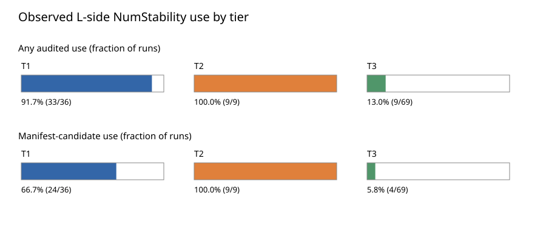
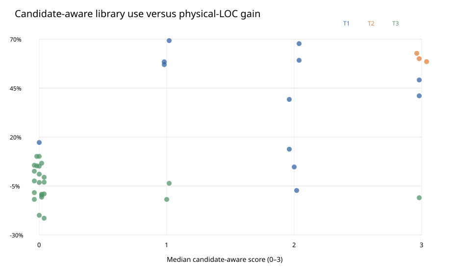
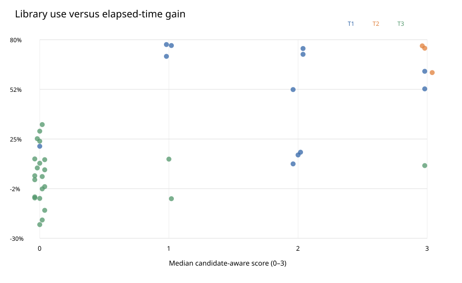
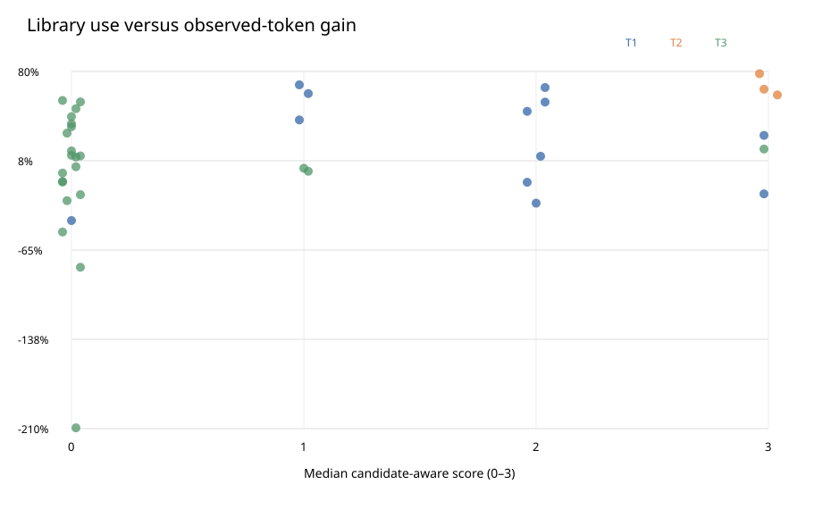
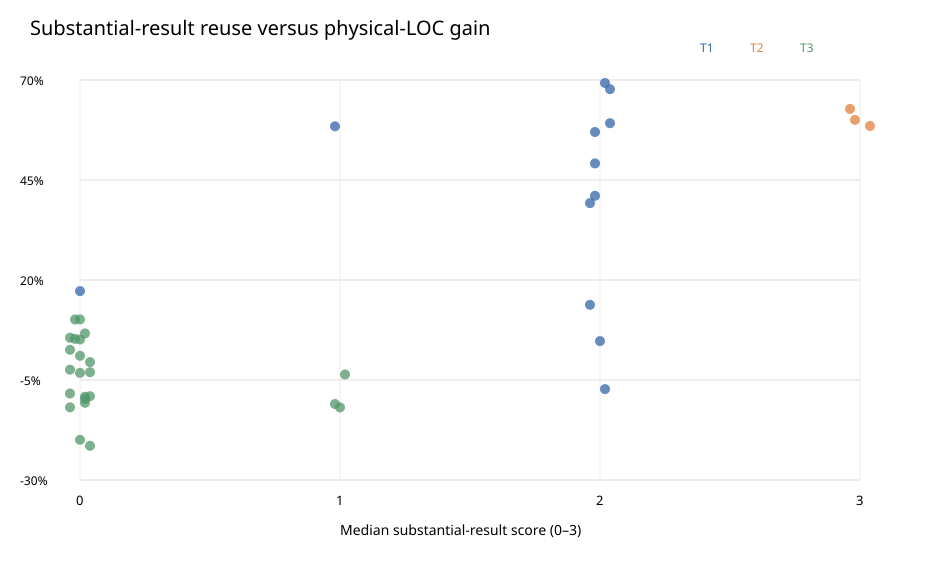
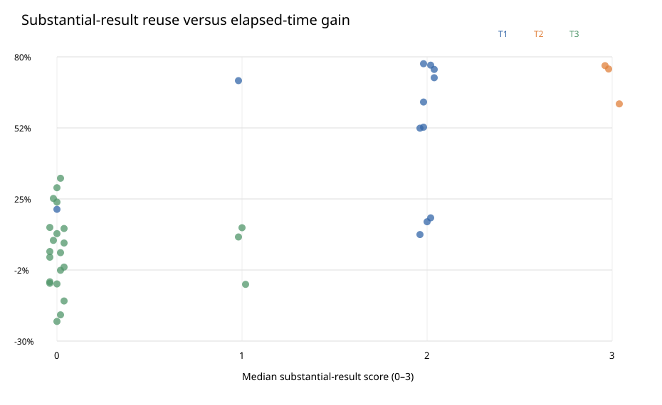

# NumStability use in accepted HighamBench answers

This is a reproducible **observational analysis** of the accepted N/L Lean answers used by the repository's selected-tier report. It covers 38 tasks, 114 paired repetitions and 228 validated attempts: r11 for T1/T2, combined r09–r10 for T3, excluding P16-T3 because its target was documented false. No benchmark rerun or new contestant work was performed.

## Executive finding

The expected tier gradient is present in *observed* L-side use, though not universal. The strongest evidence is the existing Lean dependency audit, not the textual scan:

| Tier | Tasks | L runs | Any audited NumStability dependency | ≥1 metadata candidate | ≥1 substantial tier-rationale result | Median distance-1 declarations | Median filtered transitive declarations |
|---|---:|---:|---:|---:|---:|---:|---:|
| T1 | 12 | 36 | 33/36 | 24/36 | 29/36 | 4 | 21.5 |
| T2 | 3 | 9 | 9/9 | 9/9 | 9/9 | 8 | 43 |
| T3 | 23 | 69 | 9/69 | 4/69 | 0/69 | 0 | 0 |

T1 has meaningful exceptions, and T3 is not uniformly library-free. In particular, the selected P15-T3 answers use NumStability's matrix/norm lemmas in every repetition. These are results, not exclusions.

## Method and definitions

- **Inputs:** the two completed-pairs CSVs named above; `metadata/manifest.json` for predeclared task candidates; each accepted `accepted_proof.lean` and `attempt.json`. The script verifies the accepted-proof SHA-256 against its attempt record, all pass flags, the completeness of the hidden Lean dependency audit, the condition and pair identities, and absence of NumStability dependencies in N.
- **Import count:** distinct `import NumStability...` module lines. Imports show availability only, not proof use.
- **Qualified occurrences / distinct names:** lexical `NumStability.*` references outside imports, Lean comments and strings. These can include repeated rewrites, definitions and unused helper code; they are not by themselves a semantic usage measure.
- **Qualified live names:** lexical references matched to some declaration in the accepted theorem's audited dependency closure. This removes some syntactically present but unused references; name-prefix matching remains approximate.
- **Distance-1 declarations:** NumStability declarations directly in the target theorem's dependency graph according to the saved Lean audit. **Transitive declarations** include their downstream library dependencies, so their count is a footprint rather than the number of deliberate theorem applications. **Module count** is the breadth of that closure.
- **Filtered transitive declarations:** the same closure after dropping names matching `_private`, `._proof_` and `.match_`. The CSV field is `public_transitive_declarations`, but this heuristic is **not** a complete public-API classifier. It is still a dependency footprint, not a count of applications.
- **Metadata-candidate hits:** intersection of the audited closure with `candidate_library_dependencies_for_audit` in the repository's task manifest. A hit is task-specific evidence but the lists are not exhaustive; zero does not imply zero helpful use. The `candidate_distance1_hits` column distinguishes near/direct hits from deeper reach. The present repository manifest is hashed in this analysis, but its byte identity with a campaign-time manifest was not established; treat this as a retrospective classification.
- **Candidate-aware usage score (per run):** 0=no audited library dependency; 1=some dependency but no manifest-candidate hit; 2=one candidate hit; 3=two or more candidate hits. The task score is the median of its three runs. It is an ordinal description of observed reuse, not a claim that score 3 exhausts the library or causes a performance gain.
- **Substantial-result score (per run):** a separate [semantic catalog](semantic_catalog.json) names the substantial error/probability results in T1/T2 tier rationales and documented alternatives. Score 0=no audited use; 1=library used but none of these results reached; 2=at least one such result in the accepted theorem closure; 3=two or more *explicitly named in accepted source* and in the closure. T3 has no predesignated substantial result by definition; a T3 score of 1 may still represent useful foundational lemmas. This score therefore partly reflects the task-tier design and must not be used as an independent validation of the tiers.
- **Gain:** `(N − L)/N × 100%`; positive values favor L. Task gains use the arithmetic mean N and L values over the three repetitions. All reported token counts are *observed lower bounds*, not complete token usage, so token gains are descriptive only.

## Complementary measurements

| Tier | Runs with import | Runs with qualified reference | Median distinct qualified refs | Median distinct imported modules | Median audited modules | Runs with ≥2 candidate hits | Runs with ≥1 substantial result |
|---|---:|---:|---:|---:|---:|---:|---:|
| T1 | 33/36 | 33/36 | 6 | 1 | 4 | 6/36 | 29/36 |
| T2 | 9/9 | 9/9 | 10 | 2 | 5 | 9/9 | 9/9 |
| T3 | 9/69 | 9/69 | 0 | 0 | 0 | 4/69 | 0/69 |

Raw source and semantic dependency measures agree on the presence/absence pattern in this corpus. They do **not** measure the same quantity: transitive closure can be large because one theorem depends on many helpers; an import can be unused.

## Per-task results

Each task row summarizes three accepted L answers. `Use` and `cand` are repetition counts. `d1` and `all` are mean audited distance-1 and transitive declaration counts; `qref` is the mean count of distinct qualified names in source. Positive gain favors L.

| Task | Tier | Candidate score (runs) | Substantial score (runs) | Use | cand | subst | imports | qref | d1 | all | Time gain | Token gain* | LOC gain |
|---|---|---|---|---:|---:|---:|---:|---:|---:|---:|---:|---:|---:|
| P01-T1 | T1 | 2 (0/2/2) | 2 (0/2/2) | 2/3 | 2/3 | 2/3 | 0.7 | 3.7 | 8.0 | 21.7 | +52.4% | +47.6% | +39.2% |
| P01-T2 | T2 | 3 (3/3/3) | 3 (3/3/3) | 3/3 | 3/3 | 3/3 | 2.0 | 10.0 | 11.7 | 37.0 | +75.3% | +65.6% | +60.0% |
| P02-T1 | T1 | 2 (2/2/2) | 2 (2/2/2) | 3/3 | 3/3 | 3/3 | 1.0 | 11.0 | 5.7 | 23.7 | +16.2% | -26.9% | +4.7% |
| P02-T3 | T3 | 0 (0/1/0) | 0 (0/1/0) | 1/3 | 0/3 | 0/3 | 0.3 | 3.3 | 0.0 | 7.3 | -19.9% | -209.4% | -10.7% |
| P03-T3 | T3 | 0 (0/0/0) | 0 (0/0/0) | 0/3 | 0/3 | 0/3 | 0.0 | 0.0 | 0.0 | 0.0 | -14.5% | -79.0% | -0.5% |
| P04-T1 | T1 | 2 (2/2/2) | 2 (2/2/2) | 3/3 | 3/3 | 3/3 | 1.0 | 4.0 | 0.0 | 14.0 | +11.2% | -10.0% | +13.8% |
| P05-T3 | T3 | 0 (0/0/0) | 0 (0/0/0) | 0/3 | 0/3 | 0/3 | 0.0 | 0.0 | 0.0 | 0.0 | +9.0% | -24.9% | +10.1% |
| P06-T3 | T3 | 0 (0/0/0) | 0 (0/0/0) | 0/3 | 0/3 | 0/3 | 0.0 | 0.0 | 0.0 | 0.0 | +11.6% | +43.3% | +1.0% |
| P08-T3 | T3 | 0 (0/0/0) | 0 (0/0/0) | 0/3 | 0/3 | 0/3 | 0.0 | 0.0 | 0.0 | 0.0 | +33.0% | +49.8% | +6.7% |
| P09-T3 | T3 | 0 (0/0/0) | 0 (0/0/0) | 0/3 | 0/3 | 0/3 | 0.0 | 0.0 | 0.0 | 0.0 | +7.9% | +11.4% | -9.0% |
| P11-T3 | T3 | 0 (0/0/0) | 0 (0/0/0) | 0/3 | 0/3 | 0/3 | 0.0 | 0.0 | 0.0 | 0.0 | -7.1% | -9.7% | +2.5% |
| P12-T1 | T1 | 3 (3/3/3) | 2 (2/2/2) | 3/3 | 3/3 | 3/3 | 1.0 | 10.0 | 16.0 | 47.3 | +52.8% | -19.4% | +49.1% |
| P13-T3 | T3 | 0 (0/0/0) | 0 (0/0/0) | 0/3 | 0/3 | 0/3 | 0.0 | 0.0 | 0.0 | 0.0 | +29.4% | +35.1% | -3.2% |
| P14-T1 | T1 | 2 (2/2/2) | 2 (2/2/2) | 3/3 | 3/3 | 3/3 | 1.0 | 6.7 | 6.3 | 22.7 | +17.7% | +11.1% | -7.3% |
| P15-T1 | T1 | 2 (2/2/2) | 2 (2/2/2) | 3/3 | 3/3 | 3/3 | 1.0 | 12.3 | 3.7 | 32.7 | +75.1% | +55.2% | +59.2% |
| P15-T2 | T2 | 3 (3/3/3) | 3 (3/3/3) | 3/3 | 3/3 | 3/3 | 2.0 | 12.3 | 2.7 | 95.3 | +76.6% | +78.2% | +62.8% |
| P15-T3 | T3 | 3 (3/3/3) | 1 (1/1/1) | 3/3 | 3/3 | 0/3 | 1.0 | 12.3 | 0.0 | 30.7 | +10.3% | +17.0% | -11.0% |
| P17-T1 | T1 | 0 (0/0/1) | 0 (0/0/1) | 1/3 | 0/3 | 0/3 | 0.3 | 1.3 | 2.0 | 4.0 | +21.0% | -41.0% | +17.2% |
| P17-T3 | T3 | 0 (0/0/0) | 0 (0/0/0) | 0/3 | 0/3 | 0/3 | 0.0 | 0.0 | 0.0 | 0.0 | +4.2% | +2.7% | -9.7% |
| P19-T3 | T3 | 0 (0/0/0) | 0 (0/0/0) | 0/3 | 0/3 | 0/3 | 0.0 | 0.0 | 0.0 | 0.0 | +13.6% | +55.3% | -3.0% |
| P20-T3 | T3 | 0 (0/3/0) | 0 (0/1/0) | 1/3 | 1/3 | 0/3 | 0.3 | 1.3 | 0.0 | 1.3 | +14.0% | -2.5% | -11.8% |
| P23-T1 | T1 | 3 (3/3/3) | 2 (1/2/2) | 3/3 | 3/3 | 2/3 | 1.0 | 9.0 | 3.0 | 25.7 | +62.5% | +28.1% | +41.0% |
| P24-T3 | T3 | 0 (0/0/0) | 0 (0/0/0) | 0/3 | 0/3 | 0/3 | 0.0 | 0.0 | 0.0 | 0.0 | -22.4% | +11.9% | -19.9% |
| P25-T3 | T3 | 0 (0/0/0) | 0 (0/0/0) | 0/3 | 0/3 | 0/3 | 0.0 | 0.0 | 0.0 | 0.0 | -2.6% | +10.5% | -9.2% |
| P26-T1 | T1 | 2 (2/2/2) | 2 (2/2/2) | 3/3 | 3/3 | 3/3 | 1.0 | 6.0 | 4.7 | 75.0 | +71.9% | +67.0% | +67.7% |
| P27-T3 | T3 | 0 (0/0/0) | 0 (0/0/0) | 0/3 | 0/3 | 0/3 | 0.0 | 0.0 | 0.0 | 0.0 | +4.6% | -9.5% | +5.6% |
| P28-T1 | T1 | 1 (1/1/1) | 2 (2/2/2) | 3/3 | 0/3 | 3/3 | 1.0 | 5.0 | 0.0 | 21.0 | +77.3% | +69.1% | +57.0% |
| P28-T3 | T3 | 0 (0/0/0) | 0 (0/0/0) | 0/3 | 0/3 | 0/3 | 0.0 | 0.0 | 0.0 | 0.0 | -7.9% | +37.5% | +10.2% |
| P29-T1 | T1 | 1 (1/1/1) | 2 (2/2/2) | 3/3 | 0/3 | 3/3 | 1.0 | 4.7 | 3.0 | 21.0 | +76.8% | +62.0% | +69.3% |
| P29-T2 | T2 | 3 (3/3/3) | 3 (3/3/3) | 3/3 | 3/3 | 3/3 | 2.0 | 11.0 | 7.7 | 130.7 | +61.8% | +61.0% | +58.5% |
| P32-T3 | T3 | 0 (0/0/0) | 0 (0/0/0) | 0/3 | 0/3 | 0/3 | 0.0 | 0.0 | 0.0 | 0.0 | -7.6% | -50.4% | -2.4% |
| P33-T1 | T1 | 1 (2/1/1) | 1 (2/1/1) | 3/3 | 1/3 | 1/3 | 1.0 | 9.0 | 9.0 | 26.0 | +70.8% | +40.6% | +58.4% |
| P34-T3 | T3 | 0 (0/0/0) | 0 (0/0/0) | 0/3 | 0/3 | 0/3 | 0.0 | 0.0 | 0.0 | 0.0 | +23.8% | +15.5% | +5.1% |
| P35-T3 | T3 | 1 (0/1/1) | 1 (0/1/1) | 2/3 | 0/3 | 0/3 | 0.7 | 0.7 | 0.7 | 1.3 | -8.1% | -1.1% | -3.6% |
| P36-T3 | T3 | 0 (0/0/0) | 0 (0/0/0) | 0/3 | 0/3 | 0/3 | 0.0 | 0.0 | 0.0 | 0.0 | -1.4% | -20.1% | -21.4% |
| P37-T3 | T3 | 0 (0/0/0) | 0 (0/0/0) | 0/3 | 0/3 | 0/3 | 0.0 | 0.0 | 0.0 | 0.0 | +2.4% | +56.4% | -8.4% |
| P39-T3 | T3 | 0 (0/0/0) | 0 (0/0/0) | 0/3 | 0/3 | 0/3 | 0.0 | 0.0 | 0.0 | 0.0 | +25.2% | +29.9% | +5.3% |
| P40-T3 | T3 | 1 (1/1/0) | 1 (1/1/0) | 2/3 | 0/3 | 0/3 | 0.7 | 4.7 | 1.7 | 10.0 | +13.9% | +1.4% | -11.9% |

\*Observed-token lower-bound comparison, not an exact token saving.

## Usage versus efficiency

The scatter plots show **all 38 tasks**, without dropping unfavorable outcomes. Each dot is a three-run task mean; color is tier and horizontal position is median candidate-aware score. Scores are not independent of task design, so across-tier correlations are descriptive rather than causal.

The second pair of plots uses the stricter substantial-result score. Because it is anchored in tier rationales, it should be read as a robustness/descriptive view, not an independent cross-tier test.

Grouping task means by candidate-aware score makes the gross pattern visible, but mixes tier and mathematical difficulty:

| Median score | Tasks | Mean time gain | Mean LOC gain | L faster | L shorter |
|---:|---:|---:|---:|---:|---:|
| 0 | 21 | +5.5% | -2.2% | 13/21 | 9/21 |
| 1 | 5 | +46.1% | +33.8% | 4/5 | 3/5 |
| 2 | 6 | +40.7% | +29.6% | 6/6 | 5/6 |
| 3 | 6 | +56.5% | +43.4% | 6/6 | 5/6 |

Spearman correlations (task-level, ties assigned average ranks):

| Group | Tasks | Candidate score vs time | Candidate score vs LOC | Candidate score vs tokens* | Substantial score vs time | Substantial score vs LOC | d1 count vs time | d1 count vs LOC |
|---|---:|---:|---:|---:|---:|---:|---:|---:|
| All | 38 | +0.62 | +0.53 | +0.36 | +0.69 | +0.63 | +0.63 | +0.59 |
| T1 | 12 | -0.27 | -0.20 | -0.17 | +0.09 | +0.03 | -0.13 | -0.02 |
| T2 | 3 | undefined | undefined | undefined | undefined | undefined | -0.50 | -0.50 |
| T3 | 23 | +0.03 | -0.33 | -0.01 | +0.02 | -0.33 | -0.03 | -0.24 |

The score is often tied within a tier (and T2 has only three tasks); a within-tier `undefined` correlation means no score variation, not evidence of zero association. The positive across-tier associations do **not** establish an improvement trend within T1 or T3; in particular, the T1 candidate-score correlations with time and LOC are negative in this sample. No p-value or causal inference is claimed. Token correlations are especially fragile because the archived counts are incomplete.

### Mixed-use repetitions of the same task

Only six tasks have both a library-using and a non-using L repetition. The table compares *paired N/L gains* within those tasks; it controls task identity but not random run variation or the agent's decision to use the library. It is exploratory, not a causal estimate.

| Task | Tier | Using runs | Non-using runs | Mean time gain: using / non-using | Mean LOC gain: using / non-using |
|---|---|---:|---:|---:|---:|
| P01-T1 | T1 | 2 | 1 | +76.8% / -12.4% | +64.2% / -24.8% |
| P02-T3 | T3 | 1 | 2 | -12.4% / -25.3% | -22.3% / -5.2% |
| P17-T1 | T1 | 1 | 2 | +24.6% / +18.7% | +31.4% / +8.3% |
| P20-T3 | T3 | 1 | 2 | +16.2% / +13.1% | -0.4% / -18.2% |
| P35-T3 | T3 | 2 | 1 | -10.5% / -4.3% | -8.8% / +6.1% |
| P40-T3 | T3 | 2 | 1 | +13.2% / +12.8% | -23.4% / +5.9% |

The complete values, including observed-token comparisons, are in [mixed_task_usage.csv](mixed_task_usage.csv).

## What the accepted code shows

The [declaration frequency table](declaration_usage.csv) lists every audited NumStability declaration, its run/task frequency and direct distance-1 frequency. [Attempt-level data](attempt_usage.csv) gives the exact hashes and paths of all 228 accepted proofs and audit records; [pair-level data](pair_usage.csv) joins each N/L pair; [task-level data](task_usage.csv) carries the plotted values. [Association data](associations.csv) tests eleven separate usage measures against time, observed tokens and LOC, both overall and within each tier; undefined values reflect no rank variation. The audit's closure, not an import or a `grep` hit, determines `Use`.

- **P01-T1:** score sequence 0/2/2; library use 2/3; manifest-candidate use 2/3; mean physical-LOC gain +39.2%. The exact declaration names are recorded per attempt in `attempt_usage.csv`.
- **P01-T2:** score sequence 3/3/3; library use 3/3; manifest-candidate use 3/3; mean physical-LOC gain +60.0%. The exact declaration names are recorded per attempt in `attempt_usage.csv`.
- **P15-T3:** score sequence 3/3/3; library use 3/3; manifest-candidate use 3/3; mean physical-LOC gain -11.0%. The exact declaration names are recorded per attempt in `attempt_usage.csv`.
- **P17-T1:** score sequence 0/0/1; library use 1/3; manifest-candidate use 0/3; mean physical-LOC gain +17.2%. The exact declaration names are recorded per attempt in `attempt_usage.csv`.

In 4 of 228 attempts, the recorded final on-disk candidate hash differs from the accepted-proof hash. This report analyzes the **validated accepted proof used for scoring**, not that later terminal candidate. The full later candidate files are not archived here.

## Interpretation and limits

The analysis supports the narrow descriptive claim that L used NumStability much more often in the T1/T2 selected answers than in T3, and that T2 has more direct/task-listed dependency use than T1 on these runs. It does not prove that the library caused every time or LOC difference. The tiers were defined using anticipated library support, the task sample is selected, T2 has only three tasks, and repeated runs of one task are not independent papers. The metadata-candidate and semantic classifications are retrospective, not an independently validated campaign-time treatment. The dependency closure may count infrastructure declarations carried by a single invoked theorem; lexical use may miss unqualified names. Conversely, a library theorem can be available but not used. Full agent conversations and every draft are absent from this repository, so search time and abandoned routes cannot be reconstructed here. Exact statement/proof-region decomposition of every dependency would require a further Lean elaboration instrument; the saved audit covers the accepted target theorem as a whole.

## Reproduction

From the repository root, run `python3 paper_bencmark/highambench/reports/library-usage-analysis/analyze.py`. It uses only Python's standard library, writes deterministic CSV/SVG/Markdown outputs beside itself, and fails on missing or non-validated selected attempts or proof-hash mismatches. Source-input digests are in [input_hashes.json](input_hashes.json). No source or measurement record is modified.
