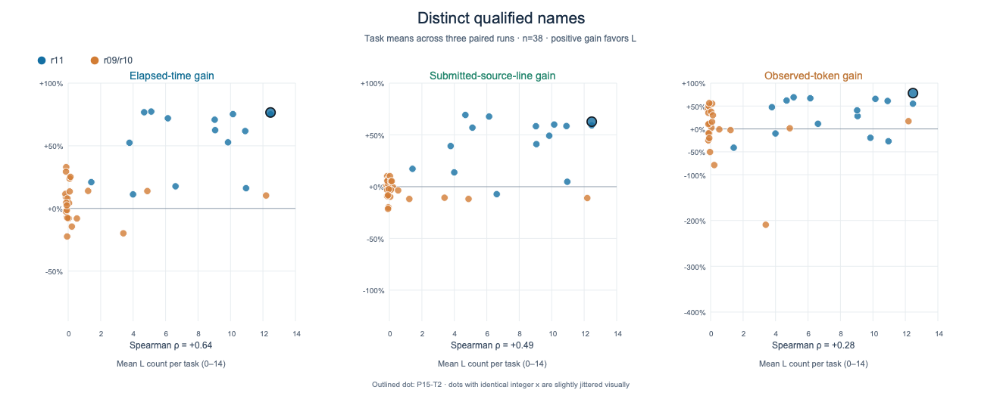
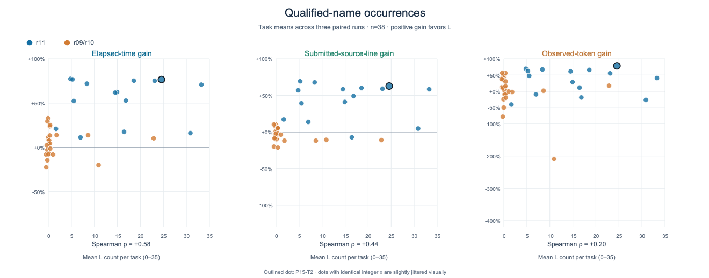
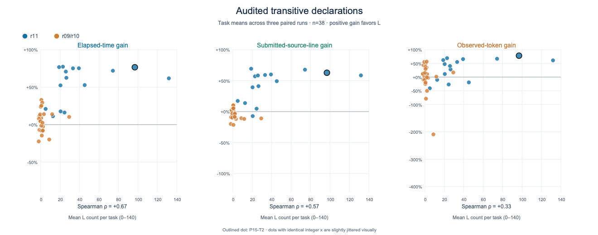

# NumStability usage: alternative measurements

This is a sensitivity view of the same 38-task archived analysis cohort and 114 paired N/L runs. It does **not** replace the accepted-proof data or select a preferred usage score. Each plot uses one raw usage measure on the horizontal axis and the same three outcomes: elapsed-time gain, submitted-source-line gain, and observed-token gain. Positive gain means L used less than N. Dots are task means across three runs; blue denotes r11 and orange denotes r09/r10. The outlined dot is P15-T2. The Spearman coefficient printed under each panel uses all 38 task means; the [machine-readable association table](associations.csv) also reports each campaign separately.

## The three requested alternatives







For P15-T2 rep-01, the counts are **13 distinct qualified names**, **30 occurrences of qualified names**, and **94 audited transitive declarations**. The plotted P15-T2 point is the mean of all three L runs: 12.33, 24.33, and 95.33, respectively. “30” does not mean 30 distinct declarations. It counts repeated written references to the same names. “94” can include indirect dependencies that the contestant never explicitly wrote.

## All other available measures

| Measure | What it counts | Time ρ | Lines ρ | Tokens ρ | Plot |
| --- | --- | ---: | ---: | ---: | --- |
| Distinct qualified names | Different written `NumStability.*` names | +0.64 | +0.49 | +0.28 | [View](figures/qualified_distinct.png) |
| Qualified-name occurrences | Every written `NumStability.*` occurrence, including repetitions | +0.58 | +0.44 | +0.20 | [View](figures/qualified_occurrences.png) |
| Audited transitive declarations | All NumStability declarations in the accepted theorem's dependency closure | +0.67 | +0.57 | +0.33 | [View](figures/transitive.png) |
| Distinct qualified live names | Different written names matched to audited dependency names | +0.64 | +0.50 | +0.29 | [View](figures/qualified_live_distinct.png) |
| Direct audited dependencies | NumStability declarations at graph distance one | +0.63 | +0.59 | +0.27 | [View](figures/distance1.png) |
| Filtered transitive declarations | Transitive count after a limited generated-name filter | +0.65 | +0.53 | +0.31 | [View](figures/public_transitive.png) |
| Imports | Distinct `NumStability` import lines | +0.67 | +0.56 | +0.34 | [View](figures/imports.png) |
| Dependency modules | Distinct NumStability modules owning audited dependencies | +0.69 | +0.59 | +0.37 | [View](figures/modules.png) |
| Task-listed candidate hits | Listed candidate names anywhere in dependency closure | +0.53 | +0.42 | +0.24 | [View](figures/candidates.png) |
| Direct candidate hits | Listed candidate names at graph distance one | +0.61 | +0.58 | +0.33 | [View](figures/direct_candidates.png) |
| Substantial audited hits | Task-relevant substantial declarations in dependency closure | +0.74 | +0.73 | +0.45 | [View](figures/substantial_hits.png) |
| Explicit substantial hits | Task-relevant substantial declarations written directly | +0.70 | +0.69 | +0.52 | [View](figures/substantial_explicit.png) |

The table coefficients are descriptive pooled Spearman correlations, not predictive validation or causal effects. In r11 alone, the time correlations are +0.23 for distinct qualified names, +0.06 for occurrences, and +0.29 for transitive declarations. The pooled association is much stronger partly because the older r09/r10 and later r11 campaigns have different runners and different usage/outcome distributions. Candidate and “substantial” measures also use task-specific classification; they are less mechanically objective than literal qualified-name counts. Imports indicate access, not necessarily use. The filtered-transitive measure is **not** a fully verified public-API count.

No count here establishes that a particular dependency was helpful, and a larger count is not automatically better. Explicit qualified names are easy to verify but miss indirect reuse. The transitive closure captures indirect use but can be inflated by generic or compiler-generated dependencies. Token gains use the archive's provider-observed token totals and retain their original limitations.

## Data and reproduction

The input is the immutable analysis snapshot in [../library-usage-analysis](../library-usage-analysis/): `attempt_usage.csv`, `pair_usage.csv`, `task_usage.csv`, and `analyze.py`. [make_plots.py](make_plots.py) joins the L attempts to task means, checks 228 attempts / 114 pairs / 38 tasks and three L runs per task, and regenerates [task_metrics.csv](task_metrics.csv), [associations.csv](associations.csv), and all SVG plots in [figures](figures/). PNGs are rasterized from those SVGs for convenient viewing. No additional task or run is removed from that cohort, and the old 0–3 score is not used as an axis.

Run from this directory:

```sh
python3 make_plots.py
for fig in figures/*.svg; do sips -s format png "$fig" --out "${fig%.svg}.png" >/dev/null; done
```
